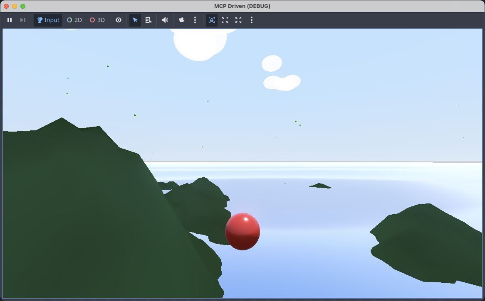

# Godot MCP Server

An MCP (Model Context Protocol) server that integrates Godot game engine with Copilot MCP, allowing LLMs to create scenes, scripts, animations, and make other changes in Godot projects.



## Features

### MCP capabilities

The server advertises `tools`, `resources`, `prompts`, and `logging`. Tools are annotated (read-only / destructive / open-world), mutation tools emit `resources/list_changed`, project content is exposed as `godot://` resources, and diagnostics are streamed over `notifications/message`. See the [MCP capabilities](#mcp-capabilities) section below for details.

### Scene Management

- **create_scene** - Create new Godot scenes (.tscn) with specified root node types
- **add_node** - Add nodes to existing scenes
- **remove_node** - Remove nodes from scenes
- **modify_node** - Modify node properties
- **read_scene** - Read scene structure as JSON
- **list_nodes** - List all nodes in a scene

### Script Generation

- **create_script** - Create GDScript files with templates or custom content
- **attach_script** - Attach scripts to scene nodes
- **read_script** - Read script file contents
- **edit_script** - Edit existing scripts
- **list_scripts** - List all scripts in project

### Animation

- **create_animation** - Create AnimationPlayer with animations
- **add_animation_track** - Add animation tracks with keyframes

### Project Management

- **init_project** - Initialize new Godot projects
- **get_project_info** - Get project information
- **list_open_projects** - List projects currently opened in Godot editor processes
- **list_scenes** - List all scene files
- **launch_editor** - Launch Godot editor
- **run_project** - Run the project
- **get_godot_version** - Get Godot version info
- **create_resource** - Create resource files (.tres)
- **run_godot_script** - Run custom GDScript inside a project and return JSON-safe results

Project-targeted tools accept `project_path`, but it is optional when Godot has an opened project. If exactly one open project is detected, the server uses it by default. If multiple projects are open, provide `project_name` or `project_path`; ambiguous requests report the available open projects so the client can ask which one to use.

Most project content operations are executed by headless Godot through the bundled `godot_operations.gd` script, so scene/resource/script reads and writes use Godot's resource APIs instead of direct filesystem parsing where practical.

### MCP capabilities

The server advertises the standard MCP capabilities and uses them alongside the tool surface:

- **`tools`** — every tool is annotated with `readOnlyHint`, `destructiveHint`, `idempotentHint`, or `openWorldHint` (per the MCP spec) so clients can show appropriate confirmation prompts and badges. Mutation tools emit `notifications/resources/list_changed` after a successful change.
- **`resources`** (with `listChanged`) — read-only Godot content is exposed as resources under the `godot://` URI scheme:
  - `godot://project` — active project metadata as JSON.
  - `godot://scene/{path}` — serialized node tree of a scene; `{path}` is a percent-encoded `res://` path (e.g. `godot://scene/res%3A%2F%2Fscenes%2Fmain.tscn`). Listed automatically when a project is resolvable.
  - `godot://script/{path}` — GDScript source; read directly from disk so it does not spawn a Godot process. Listed automatically.
  Templates are exposed via `resources/templates/list` so clients can populate a resource picker.
- **`prompts`** — workflow templates: `new-2d-player`, `new-3d-player`, `gdscript-conventions`, and `audit-scene`.
- **`logging`** — diagnostic logs (headless spawn timing, parse warnings, non-zero exits) are streamed as `notifications/message`. Clients can change verbosity with `logging/setLevel`.

The server also sends an `instructions` payload during initialization so clients can guide the model on resource usage and project selection.

## Prerequisites

- **Node.js** 18.0.0 or higher
- **Godot 4.x** installed and accessible via PATH or `GODOT_PATH` environment variable

## Installation

```bash
# Clone the repository
git clone https://github.com/koltyakov/godot-mcp.git
cd godot-mcp

# Install dependencies
npm install

# Build
npm run build
```

## Configuration

### VS Code / Copilot

Add to your VS Code settings (`.vscode/mcp.json`):

```json
{
  "mcpServers": {
    "godot": {
      "command": "node",
      "args": ["/path/to/godot-mcp/dist/index.js"],
      "env": {
        "GODOT_PATH": "/Applications/Godot.app/Contents/MacOS/Godot"  // Adjust path as needed
      }
    }
  }
}
```

## Usage Examples

### Create a new project

```
Create a new Godot project called "MyGame" at /path/to/projects/MyGame
```

### Create a player scene

```
Create a 2D player scene with a CharacterBody2D root, 
add a Sprite2D and CollisionShape2D, and attach a movement script
```

### Add animation

```
Add a jump animation to the player scene that modifies 
the position.y property over 0.5 seconds
```

## Development

```bash
# Run in development mode with hot reload
npm run dev

# Build for production
npm run build

# Run the built server
npm start
```

## Environment Variables

- `GODOT_PATH` - Path to Godot executable (optional if Godot is in PATH)

## Supported Node Types

The server supports creating most common Godot node types including:

- **2D**: Node2D, Sprite2D, Camera2D, CharacterBody2D, RigidBody2D, StaticBody2D, Area2D, CollisionShape2D, TileMap, etc.
- **3D**: Node3D, MeshInstance3D, Camera3D, CharacterBody3D, RigidBody3D, DirectionalLight3D, etc.
- **UI**: Control, Label, Button, TextureRect, Panel, etc.
- **Audio**: AudioStreamPlayer, AudioStreamPlayer2D, AudioStreamPlayer3D
- **Animation**: AnimationPlayer, AnimatedSprite2D
- **And many more...**

## Supported Resource Types

- **Shapes**: CircleShape2D, RectangleShape2D, BoxShape3D, SphereShape3D, etc.
- **Meshes**: BoxMesh, SphereMesh, CylinderMesh, PlaneMesh, etc.
- **Materials**: StandardMaterial3D, ShaderMaterial, CanvasItemMaterial
- **Textures**: GradientTexture1D, GradientTexture2D, NoiseTexture2D
- **And more...**

## License

MIT
